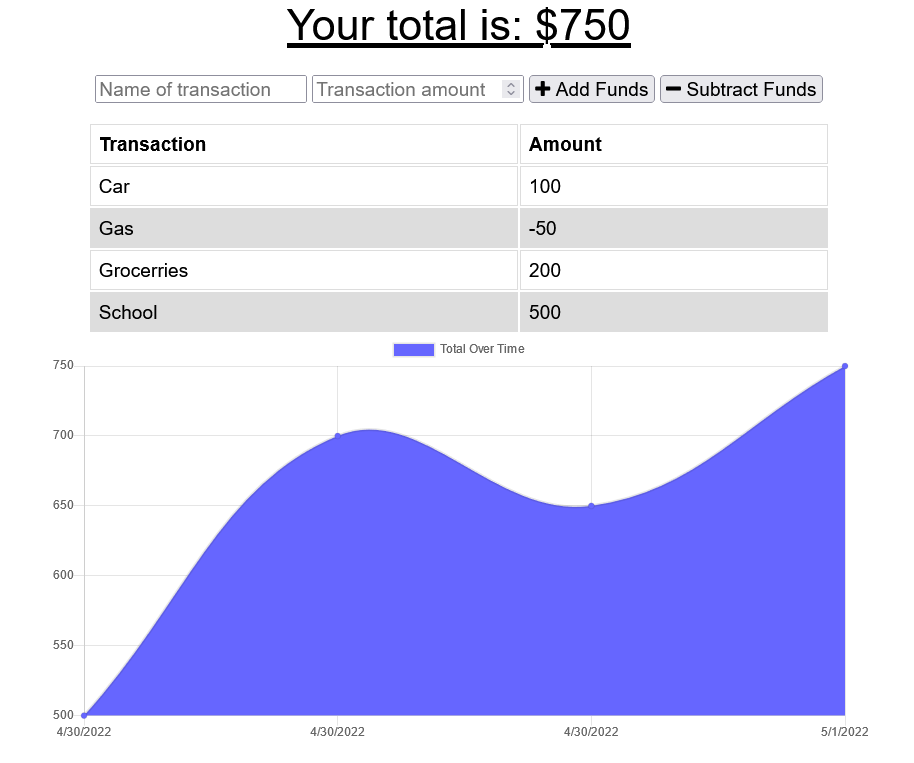

# PWA Budget Tracker
  ## 
  ### TASK: Giving users a fast and easy way to track their money is important, but allowing them to access that information at any time is even more important. Having offline functionality is paramount to the success of an application that handles users’ financial information.

### Your challenge this week is to update an existing budget tracker application to allow for offline access and functionality. The user will be able to add expenses and deposits to their budget with or without a connection. If the user enters transactions offline, the total should be updated when they're brought back online. Once you’ve made these changes, you’ll deploy the application to Heroku.
  ------------------
  ## TECHNOLOGIES USED
  ### Node.js
  ### JavaScript
  ### HEROKU
  ------------------
## SCREENSHOT

  ------------------
  ## INSTALLATION
  ### You must install the following for this app to function:
  ### Dependencies: 
  ### webpack
  ### webpack-cli
  ### Service Workers
  ------------------
  ## LICENSE  
  ### https://opensource.org/licenses/MIT
  ------------------
  ## DEPLOYMENT  
  ### https://christiandc19.github.io/pwa-budget-tracker/
  ### https://github.com/christiandc19/pwa-budget-tracker/
  ### HEROKU link: https://git.heroku.com/track-your-budgt.git
  ------------------
  ## QUESTIONS  
  ### If you have any questions, you may contact me at:
  ### Github: https://github.com/christiandc19 or,
  ### christiandc19@hotmail.com